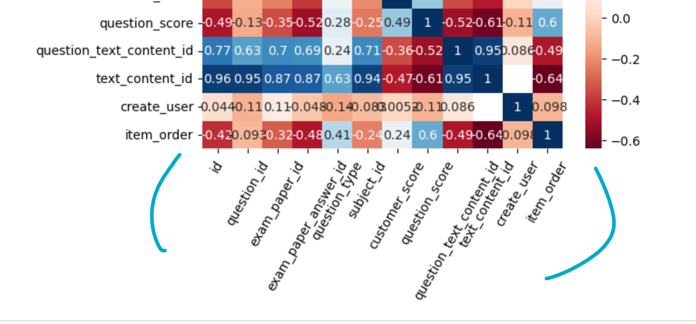
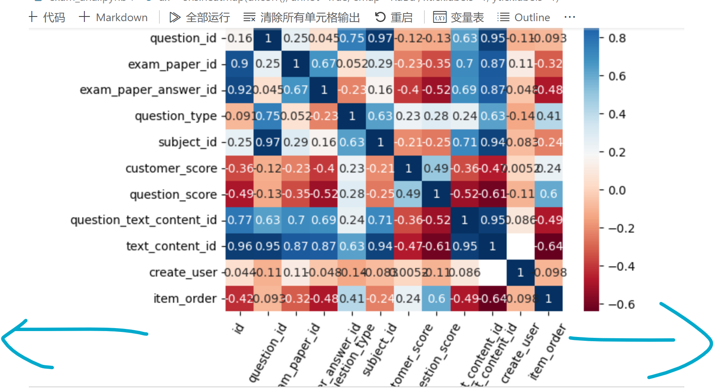

image.png



sns.heatmap ，pandas
这里斜太多了  不好看 ，但是不斜着的话 会被遮盖，能不能让横着加宽
两边拉宽

```python
ax = sns.heatmap(df.corr(), annot=True, cmap='RdBu', xticklabels=1, yticklabels=1)
fontsize=10
# get_xticklabels 宽度 
# ax.set_xticklabels(ax.get_xticklabels(), rotation=35, fontsize=fontsize)
# ax.set_xticklabels(ax.get_xticklabels(), rotation=25, fontsize=fontsize)
# ax.set_xticklabels(ax.get_xticklabels(), rotation=45, fontsize=fontsize)
ax.set_xticklabels(ax.get_xticklabels(), rotation=60, fontsize=fontsize)
ax.set_yticklabels(ax.get_yticklabels(), fontsize=fontsize)
# ax.set_yticklabels(ax.get_yticklabels(), fontsize=15)
```